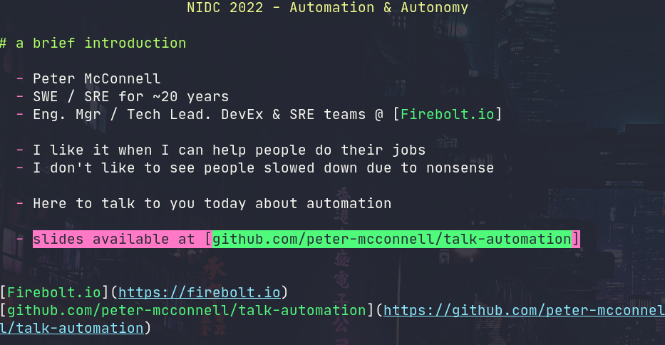
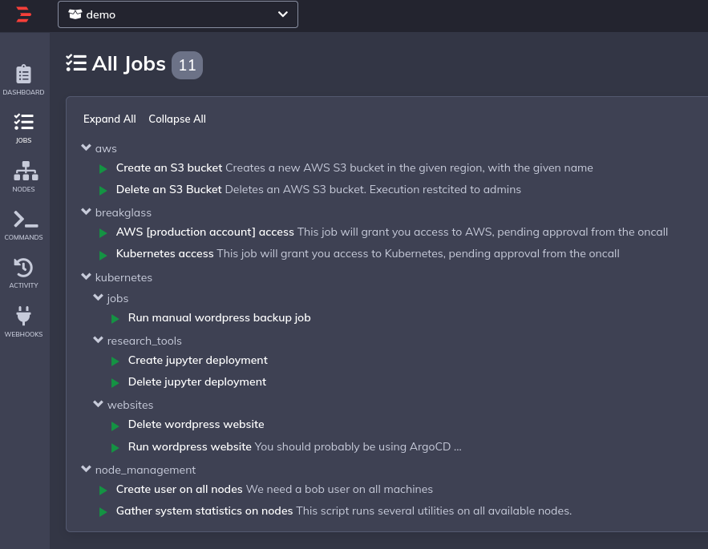
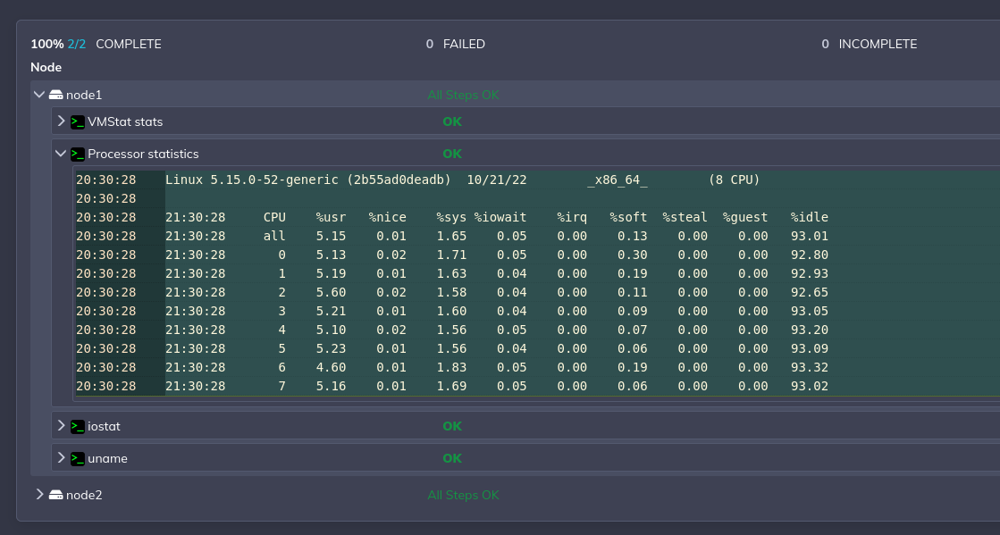

automation talk
===============

Artefacts that accompany a talk for https://www.nidevconf.com/


Slides
------



```sh
patat talk.md
```

Run
---

```sh
docker-compose up -d
```

view at: http://localhost:4440/





Requirements
------------

```sh
# tested against the following docker & docker-compose versions on ubuntu:20.04
$ docker-compose version
docker-compose version 1.29.2, build 5becea4c

$ docker version
Client: Docker Engine - Community
 Version:           20.10.18

Server: Docker Engine - Community
 Engine:
  Version:          20.10.18
```

Postgres
--------

For demo purposes I've included a backup of the postgres database in the repo itself. This is restored on the postgres container init. This file is located in ./backups/

AWS / Kubernetes
----------------

This has been naively implemented for the sake of this demo. Firstly, host level directories are mounted into the rundeck container:

- ~/.aws/
- ~/.kube/

Which means to use them from inside rundeck both AWS and Kubernetes must first be configured on the host.

Secondly a kube.config file is bundled into the repository. This is a kube config that was created as part of a local k3s cluster on the demo laptop. It will absolutely not work for you (if you really want you could replace this file with your own kube config - just ensure the server address is reachable from inside the rundeck container (i.e. a server address of 127.0.0.1 will need changed to something outside of the container)
